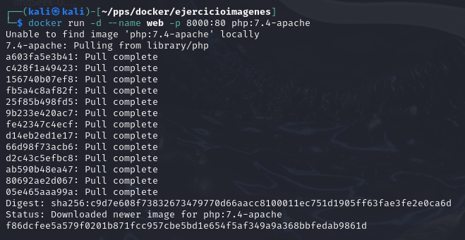
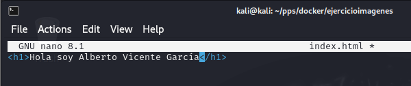
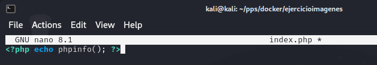
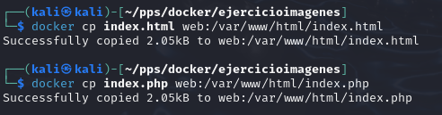
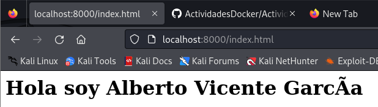
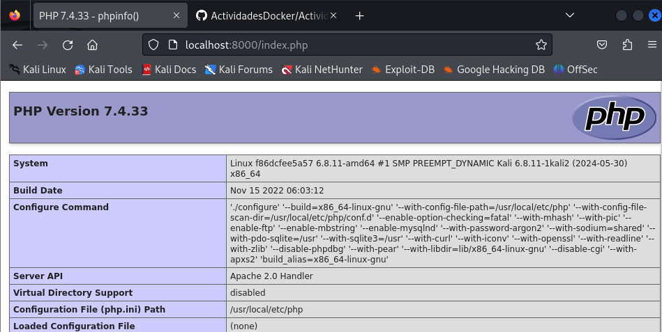
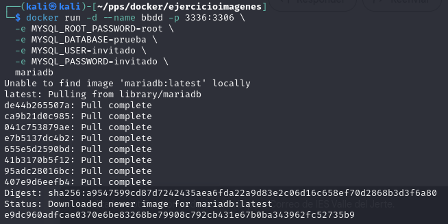
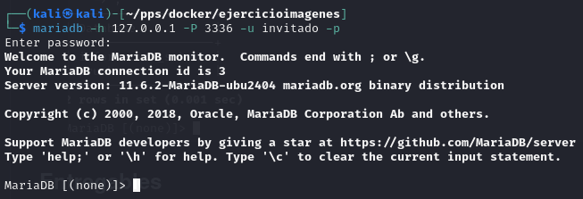
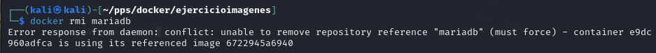

# Ejercicio para entregar

## Servidor web

1. Configuración del Servidor Web.
Arrancamos el contenedor web con la imagen php:7.4-apache en el puerto 8000.
Ejecute el siguiente comando para crear y arrancar el contenedor:

    ```html
    docker run -d --name web -p 8000:80 php:7.4-apache
    ```



Crear los archivos index.html y index.php en el contenedor
Puedes elegir una de las tres alternativas indicadas. Aquí usaremos docker cp por simplicidad.

Crear el archivo index.html en tu sistema local con el contenido siguiente:

    ```html
    <h1>HOLA SOY Alberto Vicente García</h1>
    ```


Crear el archivo index.php en tu sistema local con el contenido siguiente:

    ```php
    <?php echo phpinfo(); ?>
    ```


Copiar los archivos al contenedor:

     ```html
    docker cp index.html web:/var/www/html/index.html
    docker cp index.php web:/var/www/html/index.php
    ```



Verificar que los archivos funcionan correctamente

Abre un navegador web e ingresa a las siguientes URLs para validar los archivos:
http://localhost:8000/index.html → Debe mostrar "HOLA SOY Alberto Vicente García".



http://localhost:8000/index.php → Debe mostrar la página de información de PHP.


   


## Servidor de base de datos

2. Configuración del Servidor de Base de Datos

Arrancamos el contenedor bbdd con las variables de entorno
Ejecuta el siguiente comando para crear el contenedor:

     ```html
    docker run -d --name bbdd -p 3336:3306 \
    -e MYSQL_ROOT_PASSWORD=root \
    -e MYSQL_DATABASE=prueba \
    -e MYSQL_USER=invitado \
    -e MYSQL_PASSWORD=invitado \
     mariadb
    ```



Conectar al servidor de base de datos desde tu ordenador



Valida que existe la base de datos prueba ejecutando el comando:

    ```sql
    SHOW DATABASES;
    ```


Intentar eliminar la imagen mariadb mientras el contenedor está en uso
Ejecuta el siguiente comando:

    ```html
    docker rmi mariadb
    ```



Esto generará un error indicando que no se puede eliminar la imagen porque el contenedor bbdd está en uso.
