## Opción 1: Creación y uso de volúmenes
1. Crear volúmenes
Crea dos volúmenes con docker volume:

    ```html
    docker volume create volumen_datos
    docker volume create volumen_web
    ```

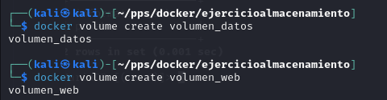

2. Arrancar contenedor c1
Arranca un contenedor llamado c1 con la imagen php:7.4-apache y monta el volumen volumen_web:

    ```html
    docker run -d --name c1 -p 8080:80 -v volumen_web:/var/www/html php:7.4-apache
    ```

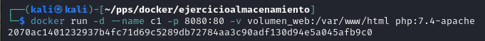

3. Arrancar contenedor c2
Arranca un contenedor llamado c2 con la imagen mariadb y monta el volumen volumen_datos. La contraseña del root será admin:

    ```html
    docker run -d --name c2 -e MYSQL_ROOT_PASSWORD=admin -v volumen_datos:/var/lib/mysql mariadb
    ```

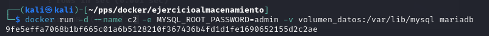

4. Borrar el volumen volumen_datos
Primero, detén y elimina el contenedor c2:

    ```html
    docker rm -f c2
    ```

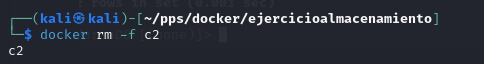

Luego, borra el volumen:

    ```html
    docker volume rm volumen_datos
    ```

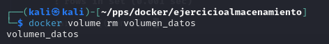

5. Copiar archivo index.html a c1
Crea el archivo index.html en tu sistema local:

    ```html
    <h1>HOLA SOY Alberto Vicente Garcia</h1>
    ```

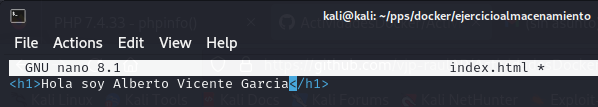

Copia el archivo al contenedor c1:

    ```html
    docker cp index.html c1:/var/www/html/index.html
    ```

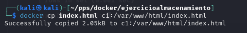

Verifica que se puede acceder en el navegador a:
http://localhost:8080/index.html

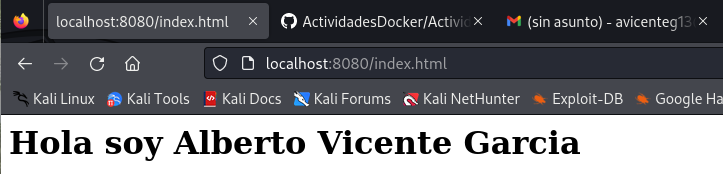

6. Crear contenedor c3
Borra el contenedor c1 y crea c3 usando el mismo volumen volumen_web pero sirviendo en el puerto 8081:

    ```html
    docker rm -f c1
    ```

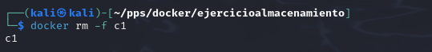

    ```html
    docker run -d --name c3 -p 8081:80 -v volumen_web:/var/www/html php:7.4-apache
    ```

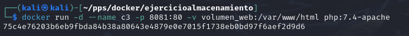

Accede en el navegador a:
http://localhost:8081/index.html

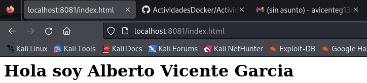

## Opción 2: Bind mount para compartir datos
1. Crear carpeta y archivo index.html
En tu sistema local, crea la carpeta saludo y el archivo index.html con:

    ```html
    mkdir saludo
    echo "<h1>HOLA SOY Alberto Vicente Garcia</h1>" > saludo/index.html
    ```

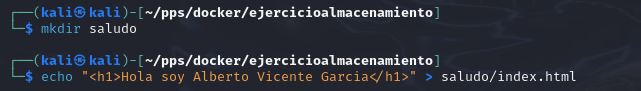

2. Arrancar contenedor c1
Arranca el contenedor c1 con bind mount en el puerto 8181:

    ```html
    docker run -d --name c1 -p 8181:80 -v $(pwd)/saludo:/var/www/html php:7.4-apache
    ```

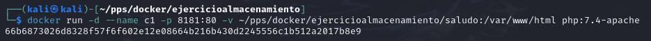

3. Arrancar contenedor c2
Arranca el contenedor c2 con bind mount en el puerto 8282:

    ```html
    docker run -d --name c2 -p 8282:80 -v $(pwd)/saludo:/var/www/html php:7.4-apache
    ```

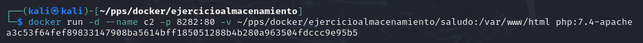

4. Verificar acceso a c1 y c2
Accede a:

http://localhost:8181/index.html (para c1)

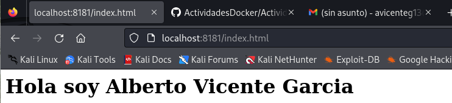

http://localhost:8282/index.html (para c2)

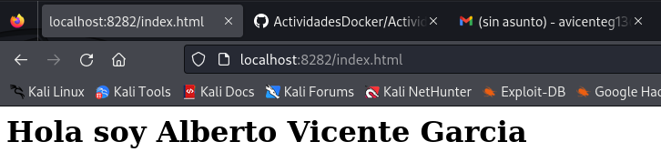

5. Modificar el archivo index.html
Modifica el archivo local:

    ```html
    echo "<h1>Hola, este es el nuevo contenido</h1>" > saludo/index.html
    ```

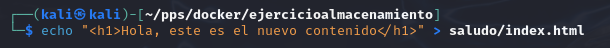

6. Comprobar acceso después de la modificación
Accede nuevamente a:

http://localhost:8181/index.html (para c1)


http://localhost:8282/index.html (para c2)

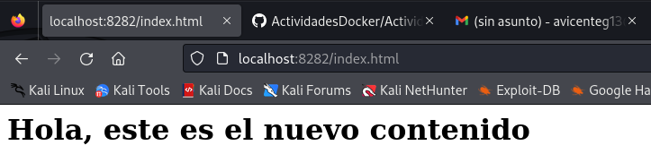
