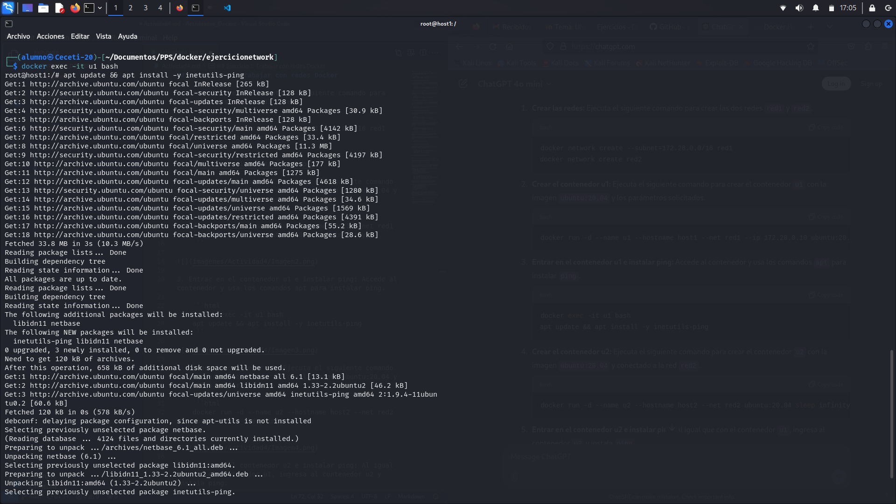

## Ejercicio 1: Trabajar con redes Docker

1. Crear las redes: Ejecuta el siguiente comando para crear las dos redes red1 y red2.

    ```html
    docker network create --subnet=172.28.0.0/16 red1
    docker network create red2
    ```


2. Crear el contenedor u1: Ejecuta el siguiente comando para crear el contenedor u1 con la imagen ubuntu:20.04 y los parámetros solicitados.

    ```html
    docker run -d --name u1 --hostname host1 --net red1 --ip 172.28.0.10 ubuntu:20.04 sleep infinity
    ```


3. Entrar en el contenedor u1 e instalar ping: Accede al contenedor y usa los comandos apt para instalar ping.

    ```html
    docker exec -it u1 bash
    apt update && apt install -y inetutils-ping
    ```



4. Crear el contenedor u2: Ejecuta el siguiente comando para crear el contenedor u2 con la imagen ubuntu:20.04 y conectado a la red red2.

    ```html
    docker run -d --name u2 --hostname host2 --net red2 ubuntu:20.04 sleep infinity
    ```


5. Entrar en el contenedor u2 e instalar ping: Al igual que con el contenedor u1, ingresa al contenedor u2 y instala ping.

    ```html
    docker exec -it u2 bash
    apt update && apt install -y inetutils-ping
    ```


6. Verificar que no pueden hacer ping entre sí: Desde el contenedor u1, intenta hacer un ping al contenedor u2 tanto por IP como por nombre. También hazlo desde u2 hacia u1.

    ```html
    ping 172.28.0.10  # Intentar ping por IP
    ping host1        # Intentar ping por nombre
    ```


Debería fallar porque los contenedores están en redes diferentes y no tienen conectividad entre ellas.

7. Conectar el contenedor u1 a la red red2: Ejecuta el siguiente comando para conectar el contenedor u1 a la red red2:

    ```html
    docker network connect red2 u1
    ```


8. Verificar la conectividad después de conectar las redes: Ahora intenta hacer ping desde u1 a u2 por IP y por nombre, y debería funcionar.

    ```html
    ping 172.18.x.x  # IP de u2 (puedes obtenerla con `docker inspect u2`) ip:172.28.0.2
    ping host2       # Nombre de host
    ```


## Ejercicio 2: Despliegue de Nextcloud + MariaDB

1. Crear una red de tipo bridge: Crea una red Docker de tipo bridge para conectar ambos contenedores.

    ```html
    docker network create nextcloud-network
    ```


2. Crear el contenedor de la base de datos MariaDB: Ejecuta el siguiente comando para crear el contenedor de MariaDB, configurando una base de datos y un usuario.

    ```html
    docker run -d --name mariadb --net nextcloud-network \
    -e MYSQL_ROOT_PASSWORD=rootpassword \
     -e MYSQL_DATABASE=nextcloud \
     -e MYSQL_USER=nextcloud_user \
      -e MYSQL_PASSWORD=nextcloud_password \
     -v mariadb_data:/var/lib/mysql \
     mariadb:10.5
    ```


3. Crear el contenedor de Nextcloud: Ahora crea el contenedor de Nextcloud, conectado a la misma red y configurado para conectarse a la base de datos.

    ```html
    docker run -d --name nextcloud --net nextcloud-network \
    -e MYSQL_PASSWORD=nextcloud_password \
    -e MYSQL_DATABASE=nextcloud \
     -e MYSQL_USER=nextcloud_user \
    -e MYSQL_HOST=mariadb \
    -v nextcloud_data:/var/www/html \
     nextcloud
    ```


4. Acceder a la aplicación Nextcloud: Una vez que los contenedores estén ejecutándose, accede a la aplicación Nextcloud desde un navegador web usando la IP de tu máquina o el nombre de host del servidor Docker, seguido del puerto 80.

