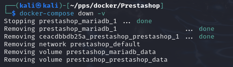

## Opción 1: Despliegue de PrestaShop

1. Modificar el archivo docker-compose.yml
Edita el archivo para configurar las variables necesarias. Cambia:

Usuario y contraseña de la base de datos: El usuario será pepe y la contraseña pepe.
Nombre de la base de datos: Cambiarlo a mitienda.
IP del servidor (si usas una máquina virtual): Modifica la variable PRESTASHOP_HOST para reflejar la IP de tu máquina.
Aquí tienes un ejemplo del archivo modificado:

    ```html
    version: '2'

    services:
        mariadb:
            image: docker.io/bitnami/mariadb:latest
            environment:
            - MARIADB_ROOT_PASSWORD=admin
            - MARIADB_USER=pepe
            - MARIADB_PASSWORD=pepe
            - MARIADB_DATABASE=mitienda
            volumes:
            - 'mariadb_data:/bitnami/mariadb'

            prestashop:
            image: docker.io/bitnami/prestashop:latest
            environment:
            - PRESTASHOP_DATABASE_HOST=mariadb
            - PRESTASHOP_DATABASE_PORT_NUMBER=3306
            - PRESTASHOP_DATABASE_NAME=mitienda
            - PRESTASHOP_DATABASE_USER=pepe
            - PRESTASHOP_DATABASE_PASSWORD=pepe
            - PRESTASHOP_HOST=<tu_ip_o_localhost>
            - ALLOW_EMPTY_PASSWORD=no
            ports:
            - '8080:8080'
            volumes:
            - 'prestashop_data:/bitnami/prestashop'
            depends_on:
            - mariadb

        volumes:
        mariadb_data:
            driver: local
            prestashop_data:
            driver: local
    ```


2. Levantar el entorno
Ejecuta el siguiente comando para levantar los contenedores:

    ```html
    docker-compose up -d
    ```


3. Acceder a PrestaShop
Accede desde tu navegador a http://localhost:8080 o a http://<IP-de-tu-máquina>:8080 si estás usando una máquina virtual.
Completa el asistente de instalación.


4. Comprobar el estado de los contenedores
Verifica que los contenedores están en funcionamiento:

    ```html
    docker-compose ps
    ```
No me funciona porque como podemos ver en la captura no se lebanta el prestadhop.


5. Borrar el escenario
Para eliminar los contenedores y los volúmenes:

    ```html
    docker-compose down -v
    ```



## Opción 2: Despliegue de Nextcloud
1. Crear el archivo docker-compose.yml
Crea un archivo llamado docker-compose.yml en un directorio de tu elección con el siguiente contenido. Puedes elegir entre MariaDB o PostgreSQL para la base de datos. Aquí usamos MariaDB:

    ```html
    version: '3.1'

    services:
        db:
            image: mariadb
            container_name: nextcloud_db
            restart: always
            environment:
            MYSQL_ROOT_PASSWORD: admin
            MYSQL_DATABASE: nextcloud
            MYSQL_USER: user
            MYSQL_PASSWORD: password
            volumes:
            - db_data:/var/lib/mysql

        app:
            image: nextcloud
            container_name: nextcloud_app
            ports:
            - 8080:80
            restart: always
            volumes:
            - nextcloud_data:/var/www/html
            environment:
            MYSQL_HOST: db
            MYSQL_DATABASE: nextcloud
            MYSQL_USER: user
            MYSQL_PASSWORD: password
            depends_on:
            - db

    volumes:
    db_data:
        driver: local
    nextcloud_data:
        driver: local
    ```


2. Levantar el entorno
Ejecuta el comando:

    ```html
    docker-compose up -d
    ```


3. Acceder a Nextcloud
Accede desde tu navegador a http://localhost:8080 o a http://<IP-de-tu-máquina>:8080 si usas una máquina virtual.
Completa el asistente de instalación.


4. Verificar los contenedores
Verifica que los contenedores están corriendo:

    ```html
    docker-compose ps
    ```


5. Comprobar la red y almacenamiento
Comprueba la creación de una red de tipo bridge:
    
    ```html
    docker network ls
    ```


Verifica los volúmenes creados:
    
    ```html
    docker volume ls
    ```


6. Borrar el escenario
Para limpiar el entorno:

    ```html
    docker-compose down -v
    ```

