## Opción 1: Creación de una imagen a partir de un contenedor
1. Arrancar un contenedor base
Inicia un contenedor desde una imagen Debian o Ubuntu:

    ```html
    docker run -it --name comandos_redes ubuntu bash
    ```

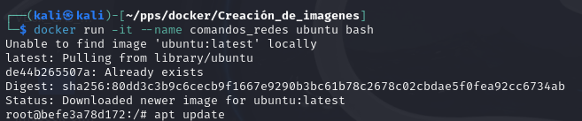

2. Instalar herramientas de red
Dentro del contenedor, instala las herramientas necesarias:

    ```html
    apt update
    apt install -y inetutils-ping iproute2 dnsutils
    ```

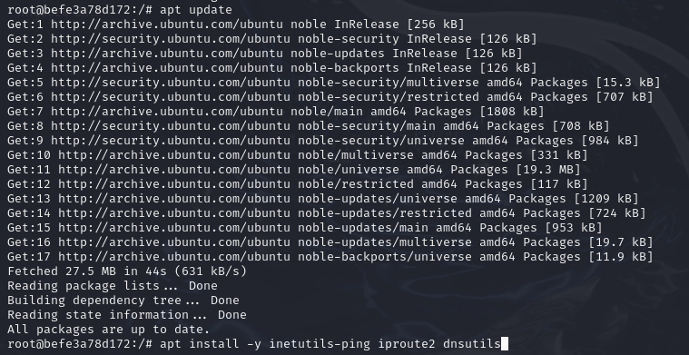

Verifica que las herramientas están instaladas correctamente ejecutando comandos como:

    ```html
    ping -c 4 8.8.8.8
    ip a
    nslookup google.com
    ```

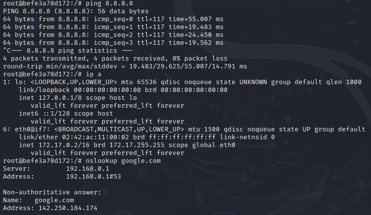

3. Crear una imagen a partir del contenedor
Sal del contenedor y guarda los cambios en una nueva imagen:

    ```html
    docker commit comandos_redes avicenteg13/comandos_redes
    ```

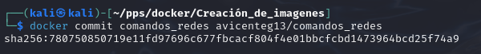

4. Subir la imagen a Docker Hub
Inicia sesión en Docker Hub desde la terminal:

    ```html
    docker login
    ```

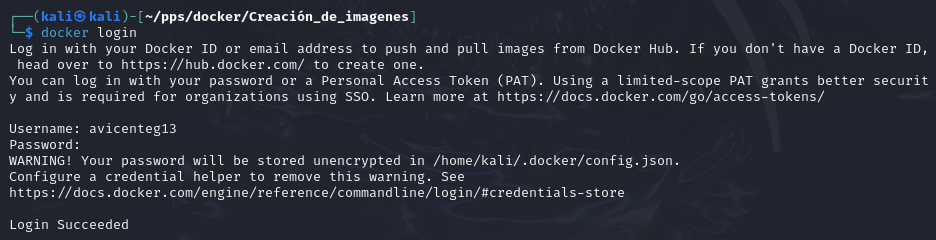

Sube la imagen a tu cuenta:

    ```html
    docker push avicenteg13/comandos_redes
    ```

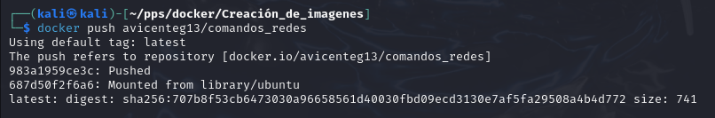

5. Descargar y probar la imagen
En otro ordenador (o tras borrar la imagen localmente), descarga la imagen y crea un nuevo contenedor:

    ```html
    docker pull avicenteg13/comandos_redes
    docker run -it --name comandos_redes_nueva avicenteg13/comandos_redes bash
    ```

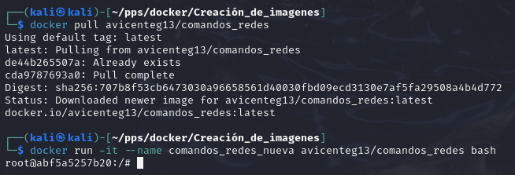

Verifica que las herramientas de red están funcionando correctamente.


## Opción 2: Creación de una imagen a partir de un Dockerfile
1. Preparar una página web estática
Crea un archivo index.html en tu máquina con contenido como el siguiente:

    ```html
    <!DOCTYPE html>
    <html lang="en">
    <head>
        <meta charset="UTF-8">
        <meta name="viewport" content="width=device-width, initial-scale=1.0">
        <title>Mi Servidor Web</title>
    </head>
    <body>
        <h1>Hola, soy <Alberto></h1>
    </body>
    </html>
    ```

Guarda este archivo en un directorio, por ejemplo, ~/mi_servidor_web.

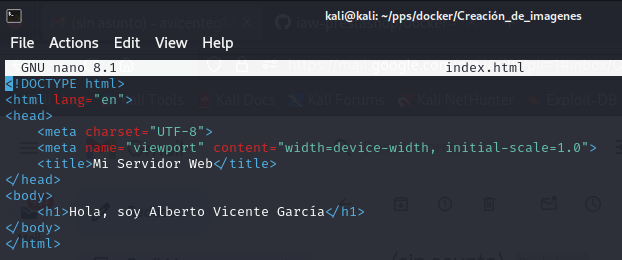

1. Crear el Dockerfile
En el mismo directorio, crea un archivo llamado Dockerfile con el siguiente contenido:

    ```html
    # Usar una imagen base con un servidor web (como nginx o apache)
    FROM nginx:latest

    # Copiar el archivo HTML al directorio donde nginx sirve sus archivos
    COPY index.html /usr/share/nginx/html/index.html
    ```

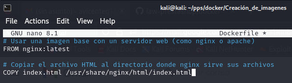

3. Construir la imagen
Ejecuta el siguiente comando para construir la imagen:

    ```html
    docker build -t avicenteg13/mi_servidor_web ~/mi_servidor_web
    ```

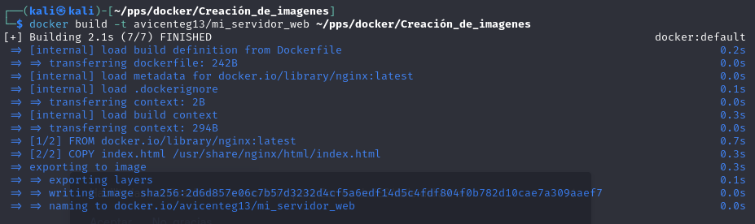

4. Subir la imagen a Docker Hub
Inicia sesión en Docker Hub si no lo has hecho aún:

    ```html
    docker login
    ```

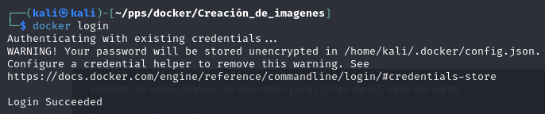

Sube la imagen:

    ```html
    docker push avicenteg13/mi_servidor_web
    ```

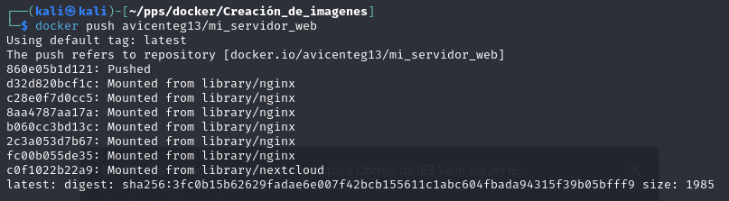

5. Descargar y probar la imagen
En otro ordenador (o tras borrar la imagen localmente), descarga la imagen:

    ```html
    docker pull avicenteg13/mi_servidor_web
    ```

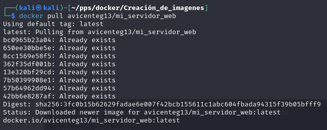

Crea un contenedor basado en la imagen descargada:

    ```html
    docker run -d -p 8080:80 --name servidor_web avicenteg13/mi_servidor_web
    ```

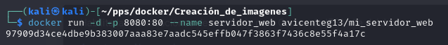 

Accede al servidor desde tu navegador en http://localhost:8080.

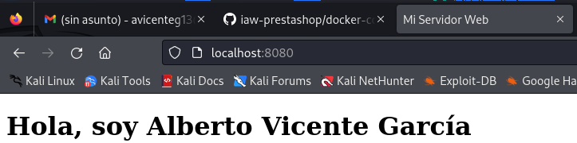